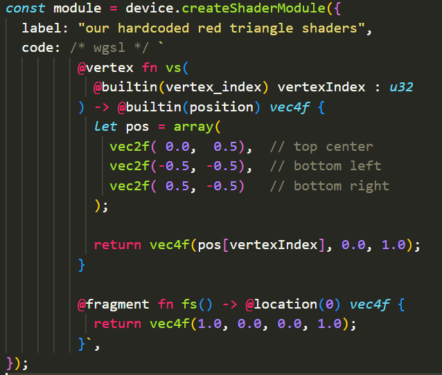
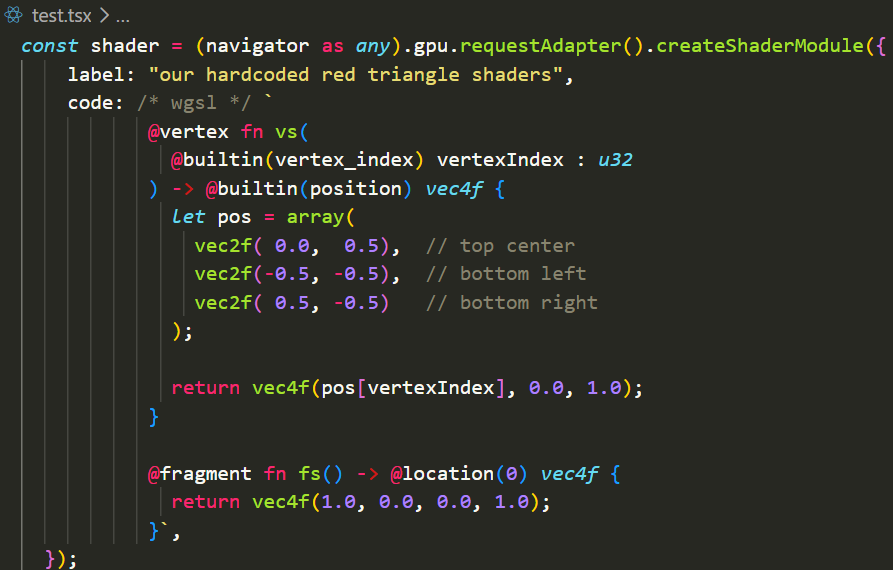
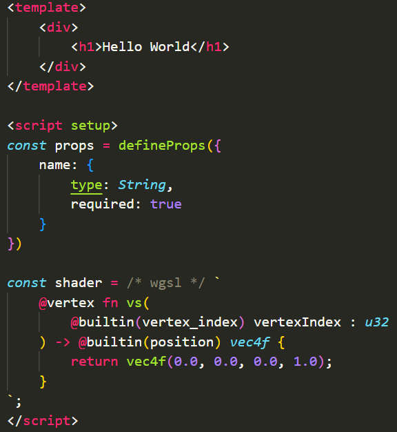
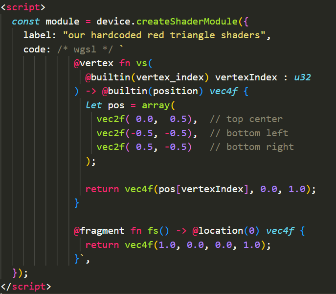
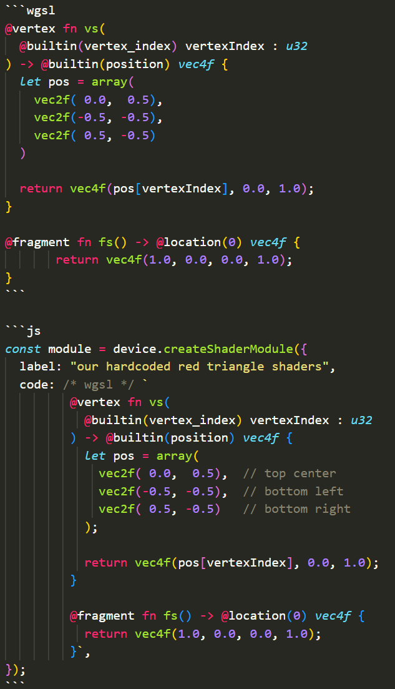

# WGSL Literal Enhanced

[English](./README.md) | [简体中文](./README.zh-CN.md)

An enhanced VS Code / Cursor extension **forked from** [gsimone/vscode-wgsl-literal](https://github.com/gsimone/vscode-wgsl-literal) ([Marketplace: `ggsimm.wgsl-literal`](https://marketplace.visualstudio.com/items?itemName=ggsimm.wgsl-literal)).

It keeps the original `/* wgsl */` template-literal highlighting and extends support to more hosts: **JavaScript, TypeScript, TSX, Vue, HTML, and Markdown**.

## Features

- Highlight WGSL inside `/* wgsl */ \`...\`` template literals
- Works in `.js` / `.mjs` / `.ts` / `.tsx` / `.vue` / `.html` / `.md`
- Markdown fenced code blocks with ` ```wgsl `
- Compatible with modern **Vue - Official** (`text.html.vue`) and older `source.vue` grammars

## Requirements

Install the [WGSL](https://marketplace.visualstudio.com/items?itemName=PolyMeilex.wgsl) extension (`PolyMeilex.wgsl`). This extension depends on its `source.wgsl` grammar.

## Usage

Prefix a template literal with a `/* wgsl */` comment:

```js
const shader = /* wgsl */ `
  @vertex fn vs(
    @builtin(vertex_index) vertexIndex : u32
  ) -> @builtin(position) vec4f {
    return vec4f(0.0, 0.0, 0.0, 1.0);
  }
`;
```

In Markdown, you can also use a fenced WGSL block:

````md
```wgsl
@fragment fn fs() -> @location(0) vec4f {
  return vec4f(1.0, 0.0, 0.0, 1.0);
}
```
````

## Examples

### JavaScript / TypeScript



### TSX



### Vue



### HTML



### Markdown



## Credits

Based on the original [vscode-wgsl-literal](https://github.com/gsimone/vscode-wgsl-literal) by [gsimone](https://github.com/gsimone) and contributors. This fork adds broader language injection (Vue, HTML, Markdown, TSX, etc.) while preserving the original commenting style.
